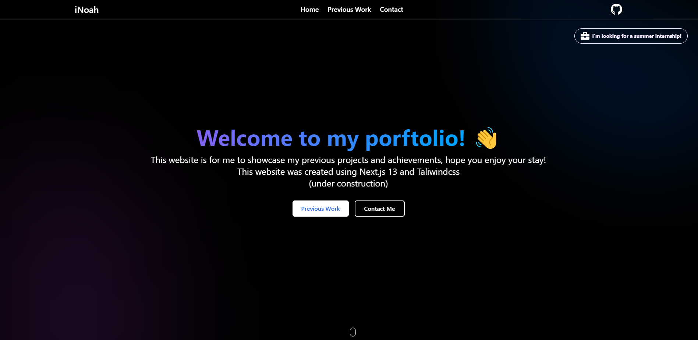

# Next.js portfolio website

A Next.js portfolio website template showcasing my (or your) skills, projects, experience, and more. Use this repo to build your own personal website and impress potential employers or clients. If you find this template helpful, please leave a ⭐️!



[](https://vercel.com/new/clone?repository-url=https%3A%2F%2Fgithub.com%2FNoahGdev%2FNext.js-Portfolio-Website)

## ✨ Features

- Modern, responsive design
- Customizable sections and components
- Built with Next.js for optimal performance
- SEO-friendly
- Easy to deploy on platforms like Vercel, Netlify, or Heroku

## 🚀 Live Demo

Check out the live demo of my portfolio website below:

[Live Demo](https://inoah.dev)

## 🏁 Getting Started

Follow these steps to set up and customize your own Next.js portfolio website:

### Prerequisites

- Node.js
- npm or yarn

### Installation

1. Fork this repository to create your own copy on GitHub.

2. Clone your forked repository:

```bash
git clone https://github.com/yourusername/your-forked-repo-name.git your-forked-repository
```
```bash
cd your-forked-repository
```

3. Install dependencies
   Choose from npm or yarn
```bash
npm install
```

### Running the Development Server

Start the development server by running the following command:
```bash
npm run dev
```
or
```bash
yarn dev
```

The server will start on port 3000 by default. Open your browser and visit [http://localhost:3000](http://localhost:3000) to view the website.

## 🌐 Deployment

Follow the instructions for deploying your project to a hosting provider, such as [Vercel](https://vercel.com/docs), [Netlify](https://www.netlify.com/docs) etc..

## 📝 TODO 

- Add Pages (PreviousWork, Contact, Maybe custom resume page)
- Add Loading.tsx for each route with skeleton
